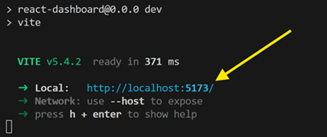

# **Collection Insights Dashboard**

## Application Overview

The *Collection Insights Dashboard* aggregates and visualizes collection data so that museum leadership and curatorial staff have a snapshot view of trends and patterns wihtin a museum’s collecting history.  

As organizations align acquisition activity with collecting priorities and mission objectives, data plays a pivotal role in this process. Quick access to meaningful information and statistics about the collection is needed to inform curatorial decisions. However, this data can often be out of reach when leadership and curators are faced with choices that impact the collection and its growth.  

As proof of concept for a highly-available, web-based application tool, the *Collection Insights Dashboard* surfaces and visualizes object-related information to empower effective and responsible collection stewardship.

### Features

Individual tiles present different aggregations of data to reveal patterns in amounts and types of objects in the collection and the contextual information around their acquisition.

Sample tiles:

- Count of objects acquired by year
- Count of objects by object type
- Count of objects by curatorial department
- Count of objects by place of origin

## Technical Components

### Frontend

- [React](https://react.dev/) (18.3.1) application with [Vite](https://vite.dev/) (5.4.1) frontend build tool, which leverages the [Tremor](https://tremor.so/) (3.18.0) chart and dashboard library and [Tailwind CSS](https://tailwindcss.com/) (3.4.10) styling framework. [ESLint](https://eslint.org/) (9.9.0) is the JavaScript code analysis tool used.  

### API

- The frontend calls the [Art Institute of Chicago API](https://api.artic.edu/docs/#introduction) for data. Currently, [“collections” endpoints](https://api.artic.edu/docs/#collections) are utilized, and calls follow the standards as put forth by the AIC.

## Dev Environment Setup

### Installations

- To run a React Vite app, install Node.js on your system, which includes npm (Node Package Manager). Node.js version 20+ is required and can be downloaded [here](https://nodejs.org/en/download/).

### Getting the sources

- From [Github](https://github.com/gwagner-2020/react-dashboard), clone the *Collection Insights Dashboard* source code on your system.

### Running the application locally

- In the command line, navigate to the *react-dashboard* project, and enter `npm run dev`.

- Open a browser window, and navigate to the localhost url provided in the command line.

## Design Challenges and Decisions

- Eager to focus initial efforts on connecting and surfacing the data, I faced the challenge of designing a UX/UI dashboard from scratch. As a result, I researched and identified available libraries, and decided upon Tremor, which provides built-in chart and dashboard templates. This was a valuable design decsion that benefited the development process.

- **Pagination TK**
